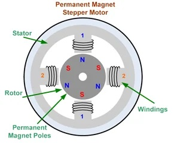
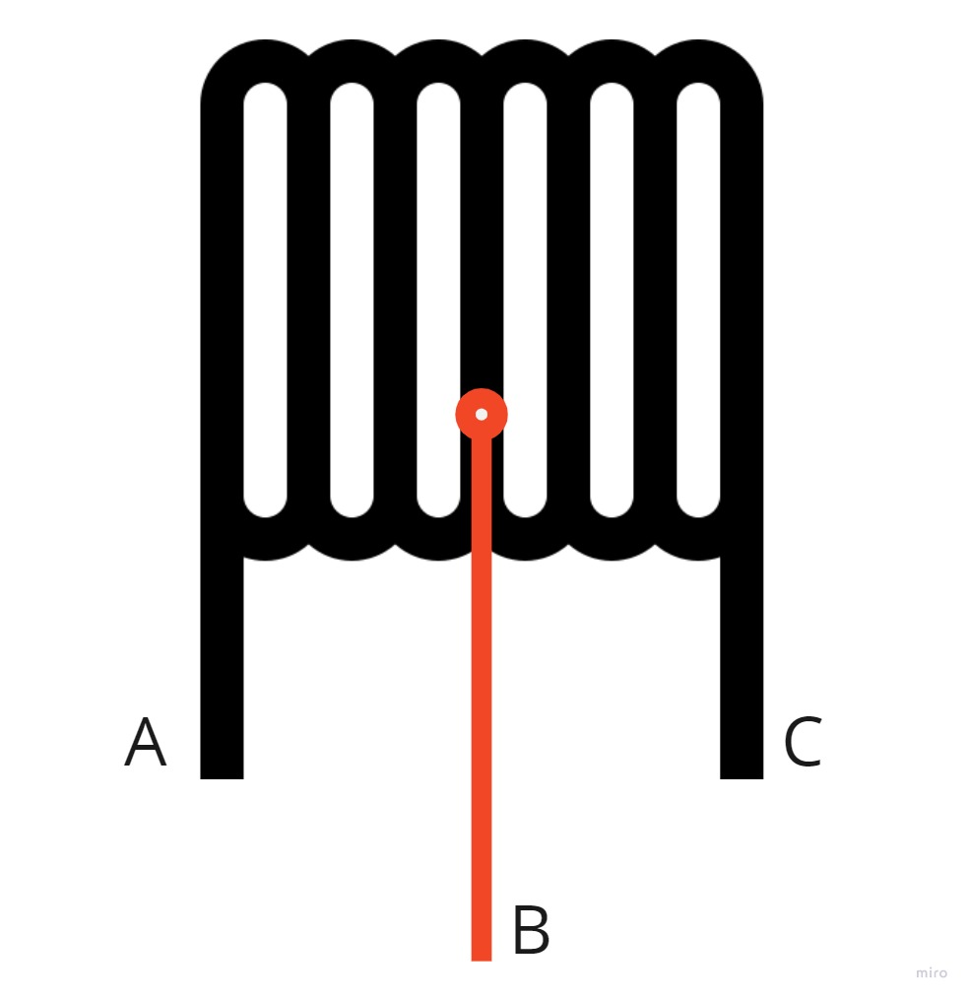

# Stepper motors

A stepper motor consists of two main parts, a rotor and a stator. The rotor is the part of the motor that actually spins and provides work. The stator is the stationary part of the motor that houses the rotor. In a stepper motor, the rotor is a permanent magnet. The stator consists of multiple coils that act as electromagnets when an electrical current is passed through them. The electromagnetic coil will cause the rotor to align with it when charged. The rotor is propelled by alternating which coil has a current running through it. 

When there is no current send to the motor, the steppers firmly hold their position. Stepper motors can also rotate without limits and change direction based on the polarity provided.

Most stepper motors come with four or six wires, stepper motors have tow coils ie, two circuits that makes 4 wires, additional two are connected to centers of the coils, therefore can be omitted. 

# Two unnecessary wires

Provided unnamed steper motors are 6-wire ones, since additional "center of the coil" wires are not needed there's a need to figure out witch is witch.

Between the wires connected to the same phase slight resistance is present, we can use that to label wires connected to same circuits. 
Between "middle of the col" wire and rest of the same circuit wires resistance will be smaller than  between other two. 

Resistance present between wires A-C will be than between A-B or B-C, therefore wire B is the unnecessary "middle of the coil" wire.

Unnamed steper motors have 6 wires, left to right:
| Id | Color  | Abbreviation | Phase |  Function   |
|:--:|:------:|:------------:|:-----:|:-----------:|
| 1  | Orange |      O       |   B   |  End wire   |
| 2  | White  |      W       |   A   | Middle Wire |
| 3  | Yellow |      Y       |   A   |  End wire   |
| 4  | Brown  |      Br      |   B   |  End wire   |
| 5  | Black  |      Bl      |   B   | Middle Wire |
| 6  |  Red   |      R       |   A   |  End wire   |

Resistances between each of them in [MΩ]:

| wire\wire | O  | W | Y  | Br | Bl | R  |
|:---------:|:--:|:-:|:--:|:--:|:--:|:--:|
|     O     | 0  | - | -  | 15 | 9  | -  |
|     W     | -  | 0 | 9  | -  | -  | 9  |
|     Y     | -  | 9 | 0  | -  | -  | 15 |
|    Br     | 15 | - | -  | 0  | 9  | -  |
|    Bl     | 9  | - | -  | 9  | 0  | -  |
|     R     | -  | 9 | 15 | -  | -  | 0  |

# A4988 Driver

[Official Documentation](https://www.pololu.com/file/0J450/a4988_DMOS_microstepping_driver_with_translator.pdf)

## Pin design:

## Pin Modes 
| J1 | Pin  |        Mode        | J2 | Pin  |     Mode      |
|:--:|:----:|:------------------:|:--:|:----:|:-------------:|
| 1  |  EN  |       Enable       | 16 | VMOT | Power Voltage |
| 2  | MS1  | Micro-step setting | 15 | GND  |    Ground     |
| 3  | MS2  | Micro-step setting | 14 |  2B  |    Phase B    |
| 4  | MS3  | Micro-step setting | 13 |  2A  |    Phase A    |
| 5  | RST  |       Reset        | 12 |  1A  |    Phase A    |
| 6  | SLP  |       Sleep        | 11 |  1B  |    Phase B    |
| 7  | STEP |        Step        | 10 | VDD  | Logic voltage |
| 8  | DIR  |  Direction input   | 9  | GND  |    Ground     |
